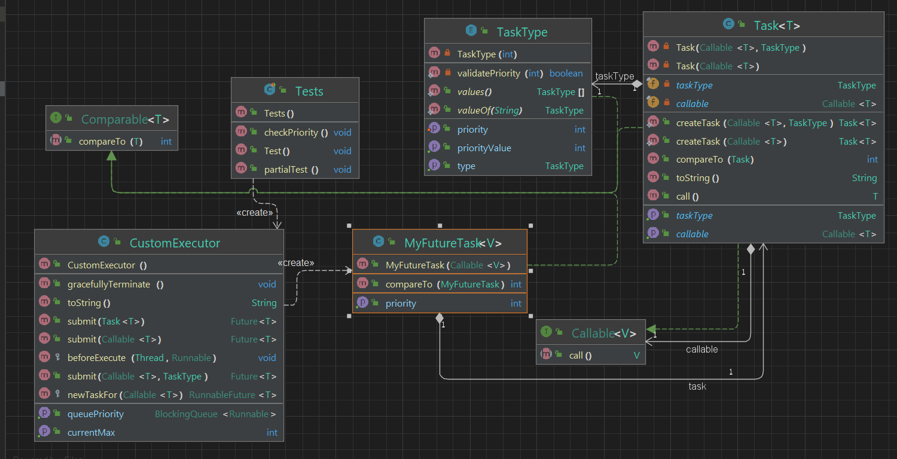

## _OOP TASK 2 -Threads_
_Authors [orel-dayan@]() & [@roy-asraf1](https://github.com/roy-asraf1)_

### Built With

* Editor : IntelliJ IDEA
* Language: Java
* JDK: 19.0.1
* JUnit 5.9.0

### Getting Start

clone this repository 
```sh
https://github.com/orel-dayan/OOP-TASK2.git
```
### Ex2_1
Run the main function and choose the number of files and max number of lines in the file in terminal.                                                               
To delete files you may use the next commands.
```sh
   cd <repository folder>/src
   rm file*
   ```
### Ex2_2
You can see and run the example in the Tests class.

## PART A:
This project provides a set of utility functions for working with text files. we create text files and calculate the total number of lines in these files.  
### We will use three methods: ####  

• Normal method without the use of threads

• Using of threads

• Using ThreadPool


### EX2_1:
A class that contains 4 functions:
- createTextFiles
- getNumOfLines
- getNumOfLinesThreads
- getNumOfLinesThreadPool

### thread:
A process (`thread`) is defined as a series of commands, which are executed serially. In a multi-process program it is possible to define several processes that are executed at the same time.
### When to use
- When we want a more "natural" solution to a problem by dividing the problem into subproblems, each of which is realized by
Another thread.
- When we want a fast response time to our input in real time.
- When we want to improve the running time of some algorithm.

### Threadpool:
A `Threadpool` is a collection of worker threads that can be used to execute tasks. When a task is submitted to the thread pool, a worker `thread` is selected to execute the task. When the task is completed, the worker `thread` returns to the pool to wait for another task. Thread pools are useful because they allow you to execute multiple tasks concurrently while limiting the number of threads that are actively executing at any given time. This can help to improve the performance and scalability of your program.
### When to use
- When you have a large number of short-lived tasks that need to be executed concurrently, a thread pool can be more efficient than creating and destroying a new `thread` for each task.
- When you want to limit the number of concurrent threads executing at any given time, you can use a thread pool to control the number of active threads.
- When you want to schedule tasks to be executed at a later time, you can use a thread pool to manage the execution of those tasks.
- When you want to execute tasks in a specific order, you can use a thread pool to ensure that tasks are executed in the desired sequence.

### Important Information:
It is important to note that using a thread pool is not always the best solution. In some cases, creating a new `thread` for each task may be more benefit. It is also important to consider the trade-offs between using a thread pool and using other concurrent execution frameworks, such as the fork-join framework or the actors model.

## Classes:
### numOfLinesThreadPool class
`numOfLinesThreadPool` is a class that implements the `Callable` interface and defines a new task that can be submitted to a thread pool.The class has a constructor that accepts a `String` name parameter and has a `call()` method that reads a file and counts the number of lines in it.The `call()` method returns the number of lines in the file as an `Integer` value. This value will be returned by the thread pool when the task is complete.
### numOfLinesThreads class
`numOfLinesThreads` is a class that extends the `Thread` class and defines a new thread.The class has a constructor that accepts a `String` name parameter and passes it to the `super` constructor. It also has a run() method that reads a file and counts the number of lines in it. the class has a getCount() method that returns the value of a counter variable that is incremented each time a line is read from the file.

## Usage
To use Ex2_1 class to Create several text files and calculate the total number of lines in these files. first insert number to the 2 next objects: numberOfFiles and maxNumberOfLines, later Implement the function with the previues objects with number to seed. After that it will automaticliiy create a new files, and will print:
- The number of lines with The time is took.
- The number of lines using Threads with The time is took.
- The number of lines using ThreadPool with The time is took.

### Conclusions
 Using a `thread pool` is a good choice for concurrent processing when you have a big number of tasks to be processed.
 It allows you to take advantage of concurrent processing while minimizing the overhead of managing multiple threads. However, for small numbers of tasks, the overhead of creating a thread pool may outweigh the benefits of concurrent processing. In such cases, using separate threads or processing the tasks sequentially may be more efficient.
 
<table>
  <tr>
    <th>Method</th>
    <th> Time (ms)</th>
    <th>Seed, Bound</th>
    <th>Number of Files</th>
    <th>Total Num of Lines</th>
  </tr>
  <tr>
    <td>getNumOfLines</td>
    <td> 5675</td>
    <td>2, 1001 </td>
    <td>1000</td>
    <td> 515033 </td>
  </tr>
    <td>getNumOfLinesThreads</td>
    <td>193</td>
    <td>2, 1001 </td>
    <td>1000</td>
    <td> 515033 </td>
  </tr>
  <tr>
    <td>getNumOfLinesThreadPool</td>
    <td>149 </td>
    <td>2, 1001 </td>
    <td>1000</td>
    <td>515033</td>
  </tr>
</table>


<table>
  <tr>
    <th>Method</th>
    <th> Time (ms)</th>
    <th>Seed, Bound</th>
    <th>Number of Files</th>
    <th>Total Number of Lines</th>
  </tr>
  <tr>
    <td>getNumOfLines</td>
    <td> 6524 </td>
    <td>2, 999</td>
    <td>1000</td>
    <td>498479 </td>
  </tr>
    <td>getNumOfLinesThreads</td>
    <td> 112</td>
    <td>2, 999 </td>
    <td>1000</td>
    <td> 498479 </td>

  <tr>
    <td>getNumOfLinesThreadPool</td>
    <td>227</td>
    <td>2, 999 </td>
    <td>1000</td>
    <td> 498479 </td>
  </tr>
</table>


## UML Part A:


# Part B:
Our goal at this part of the project is to create a new type that provides an asynchronous task with priority and a ThreadPool type that supports tasks priority.
### We created three classes:
- `MyFutureTask` 
- `Task` 
- `CustomExecutor`

## Task
This is a generic Task class that represents a task with a type that returns a result and may throw an exception. Each task has a priority used for scheduling, based on the TaskType enum.
The class has two instance variables, a callable object that contains the unit of work to be executed and a task type that determines the priority of the task. The class has two private constructors, one  that takes  a callable object and sets a default value for the pirority, and the other one takes a callable object and a task type.  
The class also has two static factory methods, createTask(Callable, TaskType) and createTask(Callable), that return new instances of the Task class. The class also has getter methods for the callable and priority instance variables and a compareTo() method that compares the priority of the current task to another task passed as a parameter.

## MyFutureTask
This is an Adapter class, which extends the FutureTask class, and implements the Comparable interface. 
The main purpose of this class is to allow the Task objects, which are passed to the submit method of the CustomExecutor class, to be used as elements in the priority queue that is used by the thread pool.

## CustomExecutor 
This class extends ThreadPoolExecutor class , which is a built-in Java class for managing a pool of threads for executing tasks.
The class has a constructor that creates a new thread pool with the number of available processors in the system and a default PriorityBlockingQueue and defines some properties such as core pool size, maximum pool size and keep-alive time. It overrides the newTaskFor method from ThreadPoolExecutor to return a MyFuture object for a new task, this method is used to create new instances of MyFuture for the ThreadPoolExecutor to use when a new task is submitted.
#### It also has three methods that are used to submit a task to the thread pool:

- submit(Task task): which is used to submit a Task object to the thread pool and increments the priority count
- submit (Callable task, TaskType taskType): which is used to submit a Callable task with a TaskType object to the thread pool
- submit (Callable task): which is used to submit a Callable task with TaskType object is set to OTHER

#### It also has the following methods:
- getCurrentMax() which returns the current maximum priority count.
- gracefullyTerminate() which calls the shutdown() method of the ThreadPoolExecutor to terminate the thread pool. 
-  method that overrides the beforeExecute method to decrement the priority count of the task before it is executed.

## Design Pattern
### Adapter Pattern
Adapter pattern is a structural design pattern that allows objects with incompatible interfaces to collaborate. The Adapter pattern is used to convert the interface of a class into another interface that clients expect. Adapter lets classes work together that couldn’t otherwise because of incompatible interfaces.
In our project, we used the Adapter pattern to allow the Task objects, which are passed to the submit method of the CustomExecutor class, to be used as elements in the priority queue that is used by the thread pool.
### Factory Method Pattern
The Factory Method pattern is a creation design pattern that provides an interface for creating objects in a superclass, but allows subclasses to alter the type of objects that will be created.
In our project, we used the Factory Method pattern to create new instances of the Task class. The class also has two static factory methods, createTask(Callable, TaskType) and createTask(Callable), that return new instances of the Task class.
Also , the CustomExecutor class uses the factory method pattern in the method submit(Callable callable, TaskType type) and submit(Callable callable) where the callable passed to the method is used to create a new task object by calling Task.createTask(callable, type) or Task.createTask(callable) respectively.
# UML Part B:



